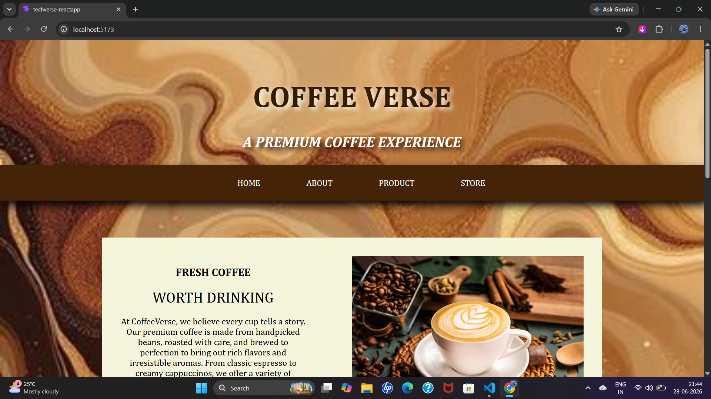

# ☕ CoffeeVerse – Coffee Shop Landing Page

CoffeeVerse is a modern coffee shop landing page developed using **React** and **Vite**. The project features a clean and responsive user interface built with reusable React components and styled using CSS Modules. It demonstrates the fundamentals of React development through a simple, organized, and component-based structure.

## 🌐 Live Demo

https://coffeeverse-react.netlify.app/

## 📸 Screenshot



## 📖 About React

React is an open-source JavaScript library used for building fast and interactive user interfaces. It follows a component-based architecture, allowing developers to divide a web application into smaller, reusable components. This improves code organization, readability, and maintainability.

In this project, React is used to create separate components for the Hero section, Navigation Bar, Coffee Information section, Promise section, Opening Hours, and Footer. These components are combined to build a complete coffee shop landing page.

## ✨ Features

* Hero Section
* Navigation Bar
* Coffee Information Section
* Our Promise Section
* Opening Hours Section
* Footer
* Responsive Layout
* Component-Based Design

## 🛠️ Technologies Used

* React
* Vite
* JavaScript (ES6+)
* HTML5
* CSS3
* CSS Modules

## ⚛️ React Concepts Used

* Functional Components
* JSX (JavaScript XML)
* Component-Based Architecture
* CSS Modules
* ES6 Import and Export
* Project Folder Structure

## 🚀 Run the Project

Clone the repository:

```bash
git clone https://github.com/achu19desg/CoffeeVerse-React.git
```

Navigate to the project folder:

```bash
cd CoffeeVerse-Landing-Page
```

Install dependencies:

```bash
npm install
```

Start the development server:

```bash
npm run dev
```

Open your browser and visit:

```text
http://localhost:5173
```
